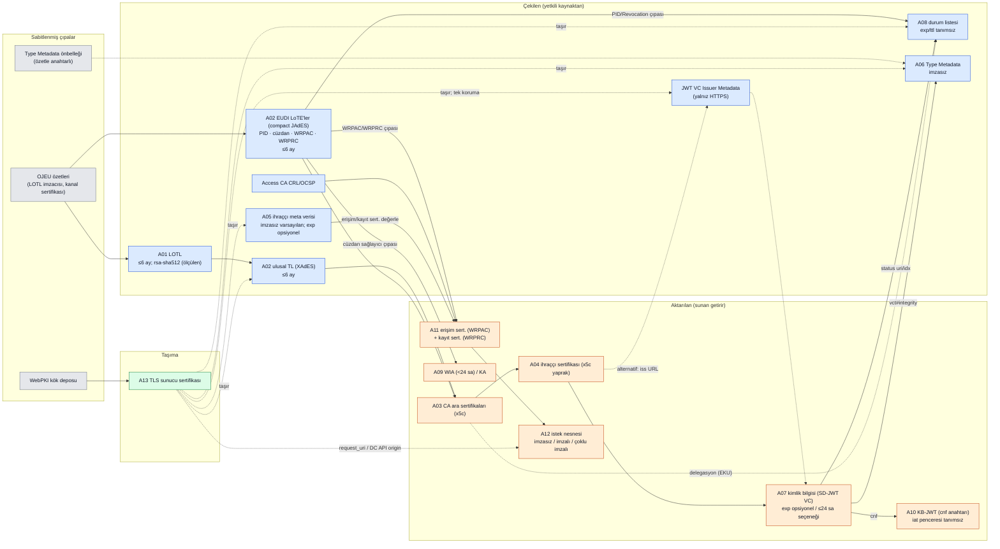

# Tehdit modeli — taslak (Adım 1)

> **Tarih:** 24.09.2026 · **Durum:** taslak. Adım 1 sonu gözden geçirmesine girdi; ASP modeli (Adım 2) bu dosyadaki tanımlarla kurulacak.
> **Temel:** `referans/00-ORTAK-SENTEZ-KARAR.md` Sürüm 3 §7.4 (artefaktlar, kanallar, S1–S3, τ, varsayımlar, G1–G5, kapsam dışı).
> **Zenginleştirme:** `01-korpus/` (51 dosya, SHA-256 sabit) ve `02-izlenebilirlik/izlenebilirlik.csv` (400 satır, 400/400 alıntı doğrulandı).
> - `Txxx` kimlikleri izlenebilirlik matrisindeki satırlardır.
> - Korpus dışı veri yalnız `veri/eu-lotl_seq394.xml`'dir (SHA-256 `24c47f10…9616`, salt okunur).
> - **Etiketler:** [S3] Sürüm 3'ten aynen · [K] korpustan eklenen/düzeltilen · [Ç] çalışmanın çıkarımı (doğrulanması Adım 2'de).

## 1. Sistem

**Roller** [S3 + K]:
- İhraççı (PID/Attestation Provider)
- Cüzdan birimi (Wallet Instance + WSCA/WSCD)
- Cüzdan sağlayıcı (WIA ve KA imzacısı)
- RP/doğrulayıcı
- Durum ihraççısı (Status Issuer; ihraççı ya da delegasyon: T159–T161, T180)
- TL/LoTE şema operatörleri: ulusal TLSO; EUDI LoTE'lerinde Komisyon (T023–T025, T029)
- Access CA ve kayıt sertifikası sağlayıcısı (T245, T258)
- WebPKI CA'ları (TLS)

**Akışlar:**
- İhraç: OID4VCI, DPoP ve WUA ile.
- Sunum:
  - OID4VP yönlendirmeli akış: JAR + `request_uri` (T284).
  - W3C DC API akışı: imzasız / imzalı / çoklu imzalı istek (T281, T278).
- HAIP 1.0 ihraçta DPoP'u zorunlu kılar (T374); sunumda DPoP yoktur.
- WIA ve KA yalnız ihraççıya sunulur, RP'ye sunulmaz (T399, T400).

## 2. Artefaktlar (13)

**Sütunlar:**
- "Temel algoritma" HAIP 1.0 §7 ve ARF v3.0.0'ın normatif metnidir. "Ölçülen" yalnız `veri/` anlık görüntüsünden gelir.
- "Kabul penceresi" spesifikasyondaki sayısal üst sınırdır. Yoksa **tanımsız** yazılır.
- "Maruziyet", imzalayanın açık anahtarının **nerede ve kime** göründüğüdür (S2/S3 için gözlem noktası).

| # | Artefakt | İmzalayan | Temel algoritma (HAIP/ARF) | Kanal | Kabul penceresi (spesifikasyon) | Açık anahtarın maruziyeti | Dayanak |
|---|---|---|---|---|---|---|---|
| A01 | LOTL | Avrupa Komisyonu (LOTL şema operatörü), nitelikli mühür | TS 119 612 §5.7.1 → TS 119 312 (T014). HAIP'te yok (güven yönetimi kapsam dışı, T128). **Ölçülen:** `rsa-sha512`; seq 394, yayım 2026-09-10T15:35:23Z, NextUpdate 2027-03-10T16:35:23Z | **çekilen**; çıpa **sabitlenmiş** (OJEU özeti) | Next update ≤ **6 ay** (T010); geçmişse atılır (T009, T003) | LOTL imzacı sertifikası OJEU'da, LOTL'de ve **her** ulusal TL'de (T005): kamuya açık, yıllarca | T001–T005, T009, T010 |
| A02 | Ulusal TL / LoTE | Ulusal TLSO (TL); Komisyon (EUDI LoTE'leri) | TL: XAdES-B-B, TS 119 312 Tablo 4/6/7 (T013, T014); PQ algoritma listesi yok (T017). LoTE: compact JAdES-B, tek imza (T023–T025). **Ölçülen (B pilotu, karar §7.17):** 107/107 TL imzacı sertifikası klasik | **çekilen** | ≤ **6 ay** (T010, T021); geçmişse atılır (T009, T019) | TL imzacı sertifikaları LOTL işaretçilerinde (43 işaretçi), kamuya açık, çok yıllık; birden çok geçerli sertifika (T018) | T008–T025, T027–T030 |
| A03 | CA (`x5c` zinciri, çıpa hariç) | CA (ihraççının güven çıpası) | HAIP §7 listesinde **yok**; X.509 profili kapsam dışı (T128, T242). ARF: ACM v2 (T133). Composite X.509 taslak (T050, T053) | **aktarılan** (ara); çıpa TL/LoTE'den **çekilen** (T063); çıpa `x5c`'de yasak (T043) | Sertifika geçerliliği; OID4VC'de **tanımsız**. TS 119 312 §9.4–9.5: çıpa/CA anahtarı doğrulama gereken süre boyunca güvenli kalmalı (T069) | TL/LoTE'de ve her kimlik bilgisinin `x5c`'sinde: kamuya açık, yıllarca | T038, T040, T043, T050–T054, T063, T065, T069 |
| A04 | İhraççı (belge imzacı) sertifikası | CA | HAIP §7'de kimlik bilgisi imzası için ES256 **zorunlu değil** ("ekosistem önceden belirler", T123, T398). ARF: ACM v2 (T133) | **aktarılan** (`x5c` yaprak, T042). Alternatif: JWT VC Issuer Metadata ile yalnız HTTPS'ten **çekilen** (T309–T311) | Sertifika `notAfter`; **tanımsız** | Her sunumda her doğrulayıcıya (`x5c`) | T039, T041, T042, T045–T047, T309–T311 |
| A05 | İmzalı ihraççı meta verisi | İhraççı (`x5c`, T084) | ES256 asgari (cüzdan doğrular, T398). `none`/MAC yasak (T077) | **çekilen** (`/.well-known`, TLS zorunlu, T070); **imzasız biçim varsayılan** (T071, T086) | `iat` REQUIRED, `exp` OPTIONAL → **tanımsız** (T075, T076) | İmzacı sertifikası herkese açık uç noktada | T070–T088, T393, T394, T398 |
| A06 | Type Metadata | **İmzasız.** Bütünlük, kimlik bilgisindeki `vct#integrity` özetinden gelir (T090) | Özet: "en güçlü desteklenen" (T091) | **çekilen** (HTTPS, T095). Özetle **süresiz önbellek** = sabitlenmiş (T093) | HTTP önbellek modeli (T094) ya da süresiz (T093) | İmza anahtarı yok; özet yoksa WebPKI sunucu anahtarı | T090–T101 |
| A07 | Kimlik bilgisi (SD-JWT VC) | İhraççı | HAIP §7'de **yok** (T123); ARF: ACM v2 (T133). `none` yasak (T102, T103). PQ "uygulama kararı" (T106) | **aktarılan** | `exp`/`nbf` OPTIONAL (T117, T118). HAIP sınırlamayı önerir (T116). ARF ≤ **24 sa** kısa ömürlü seçenek (T175). Saat payı "birkaç dakika" (T392) | İhraççı anahtarı `x5c` ile her sunumda; `cnf` (A10) | T102–T121, T123, T133, T143, T144, T175, T391, T392 |
| A08 | Durum listesi belirteci | Durum ihraççısı (ihraççı ya da EKU ile delegasyon, T159–T161) | ES256 asgari (doğrulayıcı, T170). İmza **ya da MAC** (T145) | **çekilen** (T145–T165). Çevrimdışı **aktarılan** olabilir (T166). Tasarımı taşıma güvenliğine dayanmaz (T157) | `exp` RECOMMENDED, `ttl` RECOMMENDED; sınırlar RP'ye bırakılmış → **tanımsız** (T148, T149, T162, T163) | İmzacı sertifikası `x5c`'de, herkese açık uç nokta (T167) | T145–T180 |
| A09 | Cüzdan kanıtlaması (WUA). ARF v3.0.0'da iki nesne: **WIA** ve **KA** [K] | Cüzdan sağlayıcı. PoP: cüzdan örneği anahtarı (`cnf`) | ES256 asgari (ihraççı doğrular, T196, T396); ACM v2 (T202). DPoP birleşik kip (T374–T384) | **aktarılan**; yalnız ihraççıya (T399, T400) | WIA < **24 sa** (T204). KA `exp`, jwt proof ile zorunlu (T200). İptal bakım süresi uzun (T205, T207). ABCA'da tazelik yerel politika (T186) | Cüzdan sağlayıcı anahtarı ve WIA `cnf` anahtarı yalnız ihraççılara açık | T181–T208, T374–T384, T396, T399, T400 |
| A10 | WSCD cihaz anahtarı ve KB-JWT | WSCD (Holder) | KB-JWT için ES256 asgari (T221). `none` yasak (T209). "Güvenli sayılan" alg (T213) | **aktarılan** | KB-JWT `iat` "acceptable window" (**tanımsız**, T212); `nonce` istek başına (T222, T225). Cihaz anahtarının ömrü = kimlik bilgisinin ömrü (≤ KA iptal bakım süresi, T207) | `cnf` açık anahtarı kimlik bilgisinin içinde (T218, T220): **her sunumda her doğrulayıcıya**. İhraçta KA/proof içinde ihraççıya | T209–T239 |
| A11 | RP erişim (WRPAC) ve kayıt (WRPRC) sertifikası | Access CA (WRPAC); kayıt sertifikası sağlayıcısı (WRPRC, JAdES B-B, T257) | İmzalı istek için ES256 asgari (T397). X.509 profili kapsam dışı (T242). ACM v2 | **aktarılan** (istekte değerle, T252). Çıpa LoTE'den **çekilen** (T245). İptal CRL/OCSP **çekilen** (T255); CRL önbelleği (T256) | WRPAC kısa ömürlü değil → iptal gerekir (T261, T249). WRPRC 24 saatten uzunsa iptal edilebilir (T250). Doğrulama zorunluluğu 24 ay ertelenmiş (T254) | RP anahtarı her isteğin `x5c`'sinde; kamuya açık kayıt | T240–T267 |
| A12 | OID4VP istek nesnesi | RP (erişim sertifikası anahtarı); çoklu imzada güven çerçevesi başına bir imza (T269, T273) | ES256 asgari (cüzdan, T397). Cüzdan yeteneği `request_object_signing_alg_values_supported` ile, kimliği doğrulanmamış (T285) | **aktarılan** (DC API). Yönlendirmede RP'nin kendi `request_uri`'sinden **çekilen** (T284); kaynak yetkili üçüncü taraf değil | `nonce`/`wallet_nonce`, `expected_origins` (T225, T287, T280). `iat`/`exp` **tanımsız** | RP anahtarı (A11) | T268–T301, T385–T390, T397 |
| A13 | Taşıma (TLS/WebPKI) | WebPKI CA + sunucu | BCP195 (T302, T303); sunucu sertifikası klasik [S3 varsayımı] | Sunucu sertifikası **aktarılan**; kök deposu **sabitlenmiş** (T313). Çekilen artefaktların taşıyıcısı (T070, T306, T309) | Korpusta **tanımsız** | Her el sıkışmada; kamuya açık | T302–T313, T282 |

**Tabloya ek notlar** [K]:
- **HAIP §7'nin ES256 listesi** (T122, T196, T221, T170, T395–T398) şunları kapsar:
  - ihraççı için WUA, KA ve jwt proof;
  - doğrulayıcı için KB-JWT ve durum bilgisi;
  - cüzdan için imzalı istek ve meta veri.

  İhraççının kimlik bilgisi imzası ile TL/LoTE ve X.509 zincirleri listede **yok**; bunlar ekosisteme bırakılmış (T123). Karar belgesindeki S0 ("bütün halkalar ES256/P-256, HAIP 1.0") pratikte doğru, normatif olarak kısmen doğru.
- **DPoP** ayrı bir artefakt olarak sayılmadı; A09'un (ihraç tarafı PoP) altında izleniyor (T374–T384). Sunum yolunda yok.
- **Ek çekilen artefaktlar** 13'ün dışında kalıyor ama modele kenar olarak girmeli:
  - Access CA CRL/OCSP (T255, T256);
  - JWT VC Issuer Metadata / JWK Set (T309);
  - ihraççının OAuth AS meta verisi (T188, T381).

## 3. Kanal sınıfları [S3 + K]

- **Aktarılan:** Sunan tarafın getirdiği nesneler: kimlik bilgisi, `x5c`, KB-JWT, istek nesnesi, erişim ve kayıt sertifikası, WIA/KA.
- **Çekilen:** Doğrulayıcının ya da cüzdanın **yetkili kaynaktan** getirdiği nesneler: LOTL, TL/LoTE, durum listesi, ihraççı meta verisi, Type Metadata, CRL.
- **Sabitlenmiş/önbellekli:** Bant dışı sağlanan ya da önbellekten gelen nesneler: OJEU özetleri, WebPKI kök deposu, özetli Type Metadata, CRL önbelleği.

**Korpusun eklediği iki ayrım:**
1. **"Sunanın kendi uç noktasından çekilen"** (A12 `request_uri`, T284). Biçim olarak çekilir ama kaynak, kimliği doğrulanacak tarafın kendisidir; URL de kimliği doğrulanmamış ön kanaldan gelir. H1 anlamında **çekilen sayılmamalı**; ASP'de ayrı bir kenar etiketi önerilir.
2. **"Taşıma ile ikame fiilen tanımlı"** yollar:
   - JWT VC Issuer Metadata: ihraççı anahtarı yalnız HTTPS ile (T309–T311).
   - İmzasız ihraççı meta verisi: varsayılan (T071, T083, T086).
   - İmzasız DC API isteği: origin ve WebPKI (T282).
   - LOTL indirme kanalı: OJEU özetiyle sabitlenmiş (T002).

   Buna karşılık TSL durum listesini taşıma güvenliğinden bağımsız tasarlıyor (T157). 8725bis-10, RFC 8725'teki "TLS yeterli olabilir" cümlesini kaldırmış (T307 → T308).

## 4. Güven bağımlılığı (Mermaid)

Oklar "güvenini aldığı yere" doğru değil, **doğrulama akışı** yönündedir: A → B, "A, B'nin doğrulanmasında kullanılır" demektir.

**Renkler:**
- sabitlenmiş: gri
- çekilen: mavi
- aktarılan: turuncu
- taşıma: yeşil

Aynı grafiğin Graphviz metni: `guven-bagimliligi.dot`.

**Grafiğin model için söyledikleri** [Ç]:
- G1 yolu: OJEU → LOTL → TL/LoTE → CA → ihraççı sertifikası → kimlik bilgisi. Tamamı klasik imzalı ve yıllarca açıkta. Bu zincir kuralının bariz kısmıdır; katkı değildir.
- Bariz olmayan kısım, TLS'in taşıdığı kesikli kenarlardır. Bu kenarlarda nesne imzası yok ya da isteğe bağlı: meta veri, JWT VC Issuer Metadata, özetsiz Type Metadata, imzasız istek.
  - Q-day sonrası sahte bir WebPKI sertifikası, nesne imzası PQ olsa bile bu kenarlardan girer (H1).
  - WebPKI sertifikası, TL imzacı sertifikasından çok daha kısa ömürlüdür, ama anahtar açıkta kalma penceresi yine günler-aylar ölçeğindedir [Ç].

## 5. Saldırgan sınıfları [S3 + K]

| Kod | Yetenek (Sürüm 3) | Korpustan somut saldırı yüzeyi |
|---|---|---|
| **S1** Ağ saldırganı (Dolev–Yao); Q-day öncesi ve sonrası | Soyma, yeniden oynatma, müzakereyi değiştirme. Kuantum gerekmez | JWS JSON'da imza soyma (T314, T315). Korumasız `x5chain`'de sertifika çıkarma/ekleme (T060). Kimliği doğrulanmamış yetenek alanlarını değiştirme (T072, T285, T390). Bilinmeyen parametrenin yok sayılması (T385, T387). DC API'de imzalı→imzasız düşürme (T281, T268). İmzasız meta veriye düşürme (T071). KB-JWT soyma, kural tarafından engelleniyor (T214, T216) |
| **S2** CRQC(τ, k) | Q-day sonrası, gözlediği klasik açık anahtarın özel anahtarını anahtar başına τ sürede çıkarır; pencere başına en fazla k anahtar. τ: hızlı (dakikalar) / orta (günler) / yavaş (≈26 gün) | Gözlem noktaları §2'deki "maruziyet" sütunu. Uzun ömürlü anahtarlar (LOTL/TL imzacısı, CA, WebPKI) τ'dan bağımsız olarak düşer. Kısa pencereli anahtarlar (WIA < 24 sa, ≤ 24 sa kimlik bilgisi, KB-JWT/nonce) τ'ya duyarlıdır (§7) |
| **S3** Topla-sonra-sahtele | `cnf` anahtarlarını ve artefaktları bugün kaydeder, anahtar çıkarıldıktan sonra sahteler | `cnf` her sunumda her doğrulayıcıya açıkta (T218, T220). Tek kullanımlık yalnız cüzdanda zorlanır ve geri düşer (T230, T231). OID4VP'de tek kullanımlık gizlilik amaçlı (T232). Zaman denetimi doğrulayıcıda; cüzdan süresi dolmuşu da sunabilir (T143, T144) |

**Yetenek sınırları** [S3]: S1 imzaları kıramaz. S2, PQ ve composite bileşenleri kıramaz (EUF-CMA varsayımı). S2 ve S3 WSCD'yi fiziksel olarak ele geçiremez. İçeriden saldırgan yoktur.

## 6. Varsayımlar

**Sürüm 3 varsayımları ve korpusun getirdiği notlar:**
1. ML-DSA ve SLH-DSA EUF-CMA güvenlidir; özet fonksiyonları güvenlidir.
   - [K] Composite'in SUF-CMA sağlamadığı yazılı (T346). Model yalnız EUF-CMA kullanmalı.
2. Güvenli eleman (WSCD) fiziksel olarak ele geçirilmez.
3. TL/LoTE operatörleri, ihraççılar ve RP'ler dürüsttür; içeriden saldırgan kapsam dışıdır.
4. Doğrulayıcı, sınanan politika dışında doğru çalışır.
   - [K] Korpusta RP'nin iptal denetimi ve cihaz bağı doğrulaması "önerilir, zorunlu değil" (T178, T228).
   - [K] RP kimlik doğrulaması başarısız olduğunda kullanıcıya sunma seçeneği var (T247, T253).
   - Bu yüzden model **politikayı açık bir parametre** olarak almalı (P0–P4 + "iptal denetimi var/yok", "cihaz bağı var/yok").
5. Doğrulayıcının saati doğrudur.
   - [K] RFC 7519 "birkaç dakika" pay veriyor (T392). Hızlı τ rejimiyle (dakikalar) aynı ölçekte olduğu için saat payı modelde bir parametre olmalı.
6. X25519MLKEM768 PQ gizlilik sağlar, sunucu kimlik doğrulaması klasiktir. WebPKI bağımlılığı buradan doğar.
   - [K] Korpusun TLS kuralları yalnız BCP195 ve RFC 6125'e bağlanıyor (T302–T305); PQ sertifika hiçbir yerde istenmiyor.

**Korpustan eklenen varsayımlar:**
7. **Sürüm sabitleme:** HAIP'e uyumlu doğrulayıcı SD-JWT VC -13 ve TSL -14'ü kullanır (T129, T130). Model hem -13 hem -19 semantiğini parametre olarak almalı. Fark: JSON serileştirme -13'te isteğe bağlı, -19'da kapsam dışı (T114, T113).
8. **Kayıt sertifikası doğrulaması geçiş döneminde zorunlu değil** (T254). G4 için iki faz modellenmeli: "WRPRC doğrulanmıyor" ve "WRPRC doğrulanıyor".

## 7. Güvenlik hedefleri ve korpustaki normatif karşılıkları

| Hedef | Tanım (Sürüm 3) | En yakın normatif dayanak |
|---|---|---|
| **G1** | Claims unforgeability | RFC 9901 §9.1 (T107); SD-JWT VC §2.5 (T046, T047); `x5c` doğrulaması (T038) |
| **G2** | Sunum sahtelenemezliği / holder binding | RFC 9901 §7.3, §9.5 (T212–T217); OID4VP §14.1.2, B.3.6 (T222–T225); HAIP §6.1.1.1 (T219) |
| **G3** | Revocation soundness | TSL §8.3 (T151–T156); SD-JWT VC §2.4 "SHOULD" (T172); ARF: RP için isteğe bağlı (T178); iptal tekdüze (T176) |
| **G4** | RP kimlik doğrulaması (cüzdan tarafı) | OID4VP §5.9.3 (T240, T299); HAIP §5 (T241); ARF RPA_01–06a (T244–T248); DC API'de takdir (T268) |
| **G5** | Downgrade direnci: göç etmiş bir varlık, ilan ettiği eski-sürüm penceresi dışında yalnız klasik kanıtla kabul edilemez | SD-JWT VC §7.3 (T048, T049); RFC 9901 §9.5 ilkesi (T215); 8725bis §3.1 (T328); DPoP nonce downgrade (T382); RFC 7515 `crit` (T386). **Hiçbirinde beklentiyi taşıyan kanal tanımlı değil** (OZET Bulgu 1) |

## 8. τ rejimleri × kabul pencereleri (önsel karşılaştırma) [Ç]

Pencere değerleri §2'den alınmıştır. Sonuç değil, ASP duyarlılık ızgarası (A5) için **parametre aralığı önerisidir**.

**Hücre anlamı:**
- "kırılır": anahtar açıkta kalma süresi ≫ τ.
- "sınırda": pencere ≈ τ.
- "tutar": pencere ≪ τ.

"—" bu satır için değer anlamlı değil demektir (pencere tanımsız).

| Artefakt (anahtar) | Açıkta kalma / kabul penceresi | τ hızlı (dk) | τ orta (gün) | τ yavaş (≈26 gün) |
|---|---|---|---|---|
| LOTL/TL imzacısı, CA, WebPKI | yıllar (sertifika ömrü); LOTL örneğinde NextUpdate 181 gün | kırılır | kırılır | kırılır |
| Durum listesi imzacısı | sertifika ömrü (yıllar); tek belirteç exp/ttl **tanımsız** | kırılır | kırılır | kırılır |
| Kimlik bilgisi (≤24 sa seçeneği) | ihraççı anahtarı yıllar; tek kimlik bilgisi ≤ 24 sa | kırılır* | kırılır* | kırılır* |
| WIA (< 24 sa) | cüzdan sağlayıcı anahtarı yıllar; WIA `cnf` anahtarı < 24 sa | sınırda | tutar | tutar |
| KB-JWT / cihaz anahtarı | `cnf` = kimlik bilgisi ömrü (≤24 sa … yıllar); KB-JWT `iat` penceresi saniye–dakika | sınırda / kırılır | kimlik bilgisi ömrüne bağlı | kimlik bilgisi ömrüne bağlı |
| RP erişim sertifikası | yıllar (kısa ömürlü değil, T261) | kırılır | kırılır | kırılır |
| Meta veri / istek nesnesi imzası | imzacı anahtarı yıllar; nesne penceresi tanımsız | kırılır | kırılır | kırılır |

\* Kısa ömür yalnız **yeni** kimlik bilgisi sahteciliğini değil, eski kimlik bilgisinin kabulünü sınırlar. İhraççı anahtarı uzun ömürlü olduğu sürece, çıkarılan anahtarla yeni ve geçerli kimlik bilgisi basılabilir. Bu nedenle G1'de kısa ömür **koruma sağlamaz**; bu, H5'in G1'deki karşılığıdır.

**H2 için beklenen ilginç sınırlar:**
- WIA ve `cnf` anahtarının τ_hızlı ile τ_orta arasındaki geçişi;
- saat payı (dakikalar) ile τ_hızlı'nın aynı ölçekte olması;
- çevrimdışı ve önbellekli doğrulamada durum listesi penceresinin RP politikasına göre (T163) τ'yu aşıp aşmaması.

## 9. Kapsam dışı [S3 + K]

**Sürüm 3 ile aynı:**
- sunumların HNDL gizliliği (yalnız motivasyon);
- bağlantısızlık ve gizlilik;
- erişilebilirlik ve DoS;
- yan kanallar;
- kötü niyetli ihraççı ya da TL operatörü;
- mdoc (ISO/IEC 18013-5 ücretli; yalnız "COSE_Sign1 tek imzacılı" notu);
- fiziksel BLE/NFC testleri.

**Korpus sınırından doğan ek notlar:**
- ETSI TS 119 182-1 (JAdES) korpusta yok; LoTE ve WRPRC imza profilleri onun "B-B" profiline dayanıyor. Tek imza varsayımı TS 119 602 metnindeki "compact" ifadesinden alındı (T023–T025).
- ETSI TS 119 472-2/-3 (OID4VC'nin EUDI profilleri) korpusta yok; ARF bunlara atıf yapıyor (T087). Adım 2'den önce indirilmeleri önerilir.
- EN 319 411-1'deki CRL/OCSP pencereleri korpusta yok (T255 dolaylı).

**Terim notu** [S3]: İmzalar için "CRQC sonrası sahtecilik" terimi kullanılır. "Harvest-now-decrypt-later" yalnız gizlilik için kullanılır.
