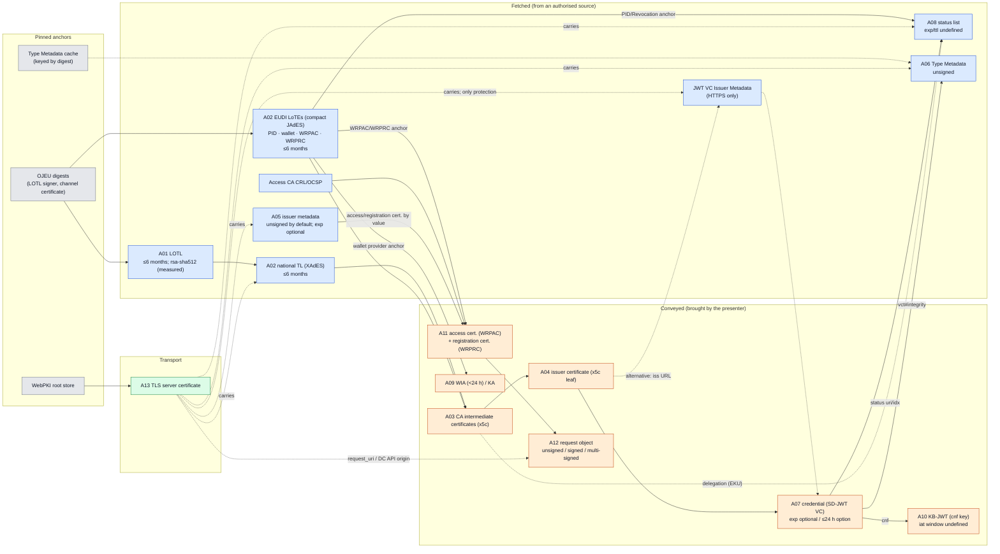

# Threat model — draft (Step 1)

> **Date:** 24.09.2026 · **Status:** draft. Input to the end-of-Step-1 review; the ASP model (Step 2) will be built with the definitions in this file.
> **Basis:** the internal design document `referans/00-ORTAK-SENTEZ-KARAR.md`, Version 3 §7.4 (artefacts, channels, S1–S3, τ, assumptions, G1–G5, out of scope). The design document is not part of this release.
> **Enrichment:** `spec-corpus/` (51 files, SHA-256 pinned) and `traceability/izlenebilirlik.csv` (400 rows, 400/400 quotes verified).
> - `Txxx` ids are rows of the traceability matrix.
> - The only data outside the corpus is `data/eu-lotl_seq394.xml` (SHA-256 `24c47f10…9616`, read-only).
> - **Labels:** [V3] verbatim from Version 3 · [C] added/corrected from the corpus · [inf] inference of the study (to be verified in Step 2).

## 1. System

**Roles** [V3 + C]:
- Issuer (PID/Attestation Provider)
- Wallet unit (Wallet Instance + WSCA/WSCD)
- Wallet provider (signer of the WIA and the KA)
- RP/verifier
- Status issuer (Status Issuer; the issuer or a delegate: T159–T161, T180)
- TL/LoTE scheme operators: national TLSO; for the EUDI LoTEs the Commission (T023–T025, T029)
- Access CA and registration certificate provider (T245, T258)
- WebPKI CAs (TLS)

**Flows:**
- Issuance: OID4VCI, with DPoP and the WUA.
- Presentation:
  - OID4VP redirect flow: JAR + `request_uri` (T284).
  - W3C DC API flow: unsigned / signed / multi-signed request (T281, T278).
- HAIP 1.0 makes DPoP mandatory at issuance (T374); there is no DPoP in presentation.
- The WIA and the KA are presented only to the issuer, not to the RP (T399, T400).

## 2. Artefacts (13)

**Columns:**
- "Baseline algorithm" is the normative text of HAIP 1.0 §7 and ARF v3.0.0. "Measured" comes only from the `data/` snapshot.
- "Acceptance window" is the numerical upper bound in the specification. If there is none, **undefined** is written.
- "Exposure" is **where and to whom** the signer's public key is visible (observation point for S2/S3).

| # | Artefact | Signer | Baseline algorithm (HAIP/ARF) | Channel | Acceptance window (specification) | Exposure of the public key | Basis |
|---|---|---|---|---|---|---|---|
| A01 | LOTL | European Commission (LOTL scheme operator), qualified seal | TS 119 612 §5.7.1 → TS 119 312 (T014). Not in HAIP (trust management out of scope, T128). **Measured:** `rsa-sha512`; seq 394, issued 2026-09-10T15:35:23Z, NextUpdate 2027-03-10T16:35:23Z | **fetched**; anchor **pinned** (OJEU digest) | Next update ≤ **6 months** (T010); discarded once passed (T009, T003) | LOTL signer certificate in the OJEU, in the LOTL and in **every** national TL (T005): public, for years | T001–T005, T009, T010 |
| A02 | National TL / LoTE | National TLSO (TL); Commission (EUDI LoTEs) | TL: XAdES-B-B, TS 119 312 Tables 4/6/7 (T013, T014); no PQ algorithm list (T017). LoTE: compact JAdES-B, single signature (T023–T025). **Measured (pilot B, decision §7.17):** 107/107 TL signer certificates classical | **fetched** | ≤ **6 months** (T010, T021); discarded once passed (T009, T019) | TL signer certificates in the LOTL pointers (43 pointers), public, multi-year; several valid certificates (T018) | T008–T025, T027–T030 |
| A03 | CA (`x5c` chain, excluding the anchor) | CA (trust anchor of the issuer) | **Not** in the HAIP §7 list; X.509 profile out of scope (T128, T242). ARF: ACM v2 (T133). Composite X.509 is a draft (T050, T053) | **conveyed** (intermediates); anchor **fetched** from the TL/LoTE (T063); anchor forbidden in `x5c` (T043) | Certificate validity; **undefined** in OID4VC. TS 119 312 §9.4–9.5: the anchor/CA key must stay secure for as long as verification is needed (T069) | In the TL/LoTE and in the `x5c` of every credential: public, for years | T038, T040, T043, T050–T054, T063, T065, T069 |
| A04 | Issuer (document signer) certificate | CA | In HAIP §7 ES256 is **not mandatory** for the credential signature ("the ecosystem determines in advance", T123, T398). ARF: ACM v2 (T133) | **conveyed** (`x5c` leaf, T042). Alternative: **fetched** only over HTTPS with JWT VC Issuer Metadata (T309–T311) | Certificate `notAfter`; **undefined** | To every verifier in every presentation (`x5c`) | T039, T041, T042, T045–T047, T309–T311 |
| A05 | Signed issuer metadata | Issuer (`x5c`, T084) | ES256 minimum (the wallet verifies, T398). `none`/MAC forbidden (T077) | **fetched** (`/.well-known`, TLS mandatory, T070); **unsigned form is the default** (T071, T086) | `iat` REQUIRED, `exp` OPTIONAL → **undefined** (T075, T076) | Signer certificate at a public endpoint | T070–T088, T393, T394, T398 |
| A06 | Type Metadata | **Unsigned.** Integrity comes from the `vct#integrity` digest in the credential (T090) | Digest: "strongest supported" (T091) | **fetched** (HTTPS, T095). With a digest **indefinite caching** = pinned (T093) | HTTP caching model (T094) or indefinite (T093) | No signing key; without a digest the WebPKI server key | T090–T101 |
| A07 | Credential (SD-JWT VC) | Issuer | **Not** in HAIP §7 (T123); ARF: ACM v2 (T133). `none` forbidden (T102, T103). PQ is an "application decision" (T106) | **conveyed** | `exp`/`nbf` OPTIONAL (T117, T118). HAIP recommends limiting (T116). ARF ≤ **24 h** short-lived option (T175). Clock allowance "a few minutes" (T392) | Issuer key via `x5c` in every presentation; `cnf` (A10) | T102–T121, T123, T133, T143, T144, T175, T391, T392 |
| A08 | Status list token | Status issuer (the issuer or a delegate via EKU, T159–T161) | ES256 minimum (verifier, T170). Signature **or MAC** (T145) | **fetched** (T145–T165). Offline it can be **conveyed** (T166). Its design does not rely on transport security (T157) | `exp` RECOMMENDED, `ttl` RECOMMENDED; limits left to the RP → **undefined** (T148, T149, T162, T163) | Signer certificate in `x5c`, public endpoint (T167) | T145–T180 |
| A09 | Wallet attestation (WUA). In ARF v3.0.0 two objects: **WIA** and **KA** [C] | Wallet provider. PoP: wallet instance key (`cnf`) | ES256 minimum (the issuer verifies, T196, T396); ACM v2 (T202). DPoP combined mode (T374–T384) | **conveyed**; only to the issuer (T399, T400) | WIA < **24 h** (T204). KA `exp`, mandatory with the jwt proof (T200). Revocation maintenance period long (T205, T207). In ABCA freshness is local policy (T186) | Wallet provider key and WIA `cnf` key visible only to issuers | T181–T208, T374–T384, T396, T399, T400 |
| A10 | WSCD device key and KB-JWT | WSCD (Holder) | ES256 minimum for the KB-JWT (T221). `none` forbidden (T209). Alg "deemed secure" (T213) | **conveyed** | KB-JWT `iat` "acceptable window" (**undefined**, T212); `nonce` per request (T222, T225). Lifetime of the device key = lifetime of the credential (≤ KA revocation maintenance period, T207) | `cnf` public key inside the credential (T218, T220): **to every verifier in every presentation**. At issuance to the issuer inside the KA/proof | T209–T239 |
| A11 | RP access (WRPAC) and registration (WRPRC) certificate | Access CA (WRPAC); registration certificate provider (WRPRC, JAdES B-B, T257) | ES256 minimum for the signed request (T397). X.509 profile out of scope (T242). ACM v2 | **conveyed** (by value in the request, T252). Anchor **fetched** from the LoTE (T245). Revocation CRL/OCSP **fetched** (T255); CRL cache (T256) | WRPAC not short-lived → revocation needed (T261, T249). WRPRC revocable if longer than 24 hours (T250). Verification obligation postponed by 24 months (T254) | RP key in the `x5c` of every request; public register | T240–T267 |
| A12 | OID4VP request object | RP (access certificate key); with multiple signatures one signature per trust framework (T269, T273) | ES256 minimum (wallet, T397). Wallet capability via `request_object_signing_alg_values_supported`, unauthenticated (T285) | **conveyed** (DC API). In the redirect flow **fetched** from the RP's own `request_uri` (T284); the source is not an authorised third party | `nonce`/`wallet_nonce`, `expected_origins` (T225, T287, T280). `iat`/`exp` **undefined** | RP key (A11) | T268–T301, T385–T390, T397 |
| A13 | Transport (TLS/WebPKI) | WebPKI CA + server | BCP195 (T302, T303); server certificate classical [V3 assumption] | Server certificate **conveyed**; root store **pinned** (T313). Carrier of the fetched artefacts (T070, T306, T309) | **Undefined** in the corpus | In every handshake; public | T302–T313, T282 |

**Additional notes on the table** [C]:
- **The ES256 list of HAIP §7** (T122, T196, T221, T170, T395–T398) covers:
  - for the issuer, the WUA, the KA and the jwt proof;
  - for the verifier, the KB-JWT and status information;
  - for the wallet, the signed request and metadata.

  The issuer's credential signature, the TL/LoTE and the X.509 chains are **not** in the list; they are left to the ecosystem (T123). The S0 of the decision document ("all links ES256/P-256, HAIP 1.0") is correct in practice and only partly correct normatively.
- **DPoP** is not counted as a separate artefact; it is tracked under A09 (issuance-side PoP) (T374–T384). It is absent from the presentation path.
- **Additional fetched artefacts** stay outside the 13 but must enter the model as edges:
  - Access CA CRL/OCSP (T255, T256);
  - JWT VC Issuer Metadata / JWK Set (T309);
  - the issuer's OAuth AS metadata (T188, T381).

## 3. Channel classes [V3 + C]

- **Conveyed:** objects brought by the presenting party: credential, `x5c`, KB-JWT, request object, access and registration certificate, WIA/KA.
- **Fetched:** objects that the verifier or the wallet obtains **from an authorised source**: LOTL, TL/LoTE, status list, issuer metadata, Type Metadata, CRL.
- **Pinned/cached:** objects provided out of band or coming from a cache: OJEU digests, WebPKI root store, Type Metadata with a digest, CRL cache.

**Two distinctions added by the corpus:**
1. **"Fetched from the presenter's own endpoint"** (A12 `request_uri`, T284). Formally it is fetched, but the source is the very party to be authenticated, and the URL also comes from the unauthenticated front channel. It should **not count as fetched** in the sense of H1; a separate edge label is proposed in ASP.
2. Paths where **"substitution by transport is in fact defined"**:
   - JWT VC Issuer Metadata: the issuer key only over HTTPS (T309–T311).
   - Unsigned issuer metadata: the default (T071, T083, T086).
   - Unsigned DC API request: origin and WebPKI (T282).
   - LOTL download channel: pinned by the OJEU digest (T002).

   In contrast, TSL designs the status list independently of transport security (T157). 8725bis-10 removed the sentence "TLS may be sufficient" of RFC 8725 (T307 → T308).

## 4. Trust dependency (Mermaid)

The arrows point in the direction of the **verification flow**, not "towards where trust comes from": A → B means "A is used in the verification of B".

**Colours:**
- pinned: grey
- fetched: blue
- conveyed: orange
- transport: green

The Graphviz text of the same graph: `guven-bagimliligi.dot`.

**What the graph says for the model** [inf]:
- G1 path: OJEU → LOTL → TL/LoTE → CA → issuer certificate → credential. All of it is classically signed and exposed for years. This is the obvious part of the chain rule; it is not a contribution.
- The non-obvious part is the dashed edges carried by TLS. On these edges there is no object signature, or it is optional: metadata, JWT VC Issuer Metadata, Type Metadata without a digest, unsigned request.
  - After Q-day a forged WebPKI certificate enters through these edges even if the object signature is PQ (H1).
  - A WebPKI certificate is much shorter-lived than a TL signer certificate, but the key exposure window is still on the scale of days to months [inf].

## 5. Attacker classes [V3 + C]

| Code | Capability (Version 3) | Concrete attack surface from the corpus |
|---|---|---|
| **S1** Network attacker (Dolev–Yao); before and after Q-day | Stripping, replay, changing the negotiation. No quantum capability needed | Signature stripping in JWS JSON (T314, T315). Removing/adding certificates in an unprotected `x5chain` (T060). Changing unauthenticated capability fields (T072, T285, T390). Ignoring an unknown parameter (T385, T387). Signed→unsigned downgrade with the DC API (T281, T268). Downgrade to unsigned metadata (T071). KB-JWT stripping, prevented by the rule (T214, T216) |
| **S2** CRQC(τ, k) | After Q-day, extracts the private key of an observed classical public key in time τ per key; at most k keys per window. τ: fast (minutes) / medium (days) / slow (≈26 days) | Observation points are the "exposure" column in §2. Long-lived keys (LOTL/TL signer, CA, WebPKI) fall regardless of τ. Keys with short windows (WIA < 24 h, ≤ 24 h credential, KB-JWT/nonce) are sensitive to τ (§7) |
| **S3** Harvest-then-forge | Records `cnf` keys and artefacts today and forges after the key has been extracted | `cnf` is exposed to every verifier in every presentation (T218, T220). Single use is enforced only in the wallet and falls back (T230, T231). In OID4VP single use serves privacy (T232). The time check is at the verifier; the wallet may also present an expired one (T143, T144) |

**Capability limits** [V3]: S1 cannot break signatures. S2 cannot break PQ and composite components (EUF-CMA assumption). S2 and S3 cannot physically capture the WSCD. There is no insider attacker.

## 6. Assumptions

**Version 3 assumptions and the notes brought by the corpus:**
1. ML-DSA and SLH-DSA are EUF-CMA secure; the hash functions are secure.
   - [C] It is written that composite does not provide SUF-CMA (T346). The model must use only EUF-CMA.
2. The secure element (WSCD) is not physically captured.
3. TL/LoTE operators, issuers and RPs are honest; an insider attacker is out of scope.
4. The verifier works correctly outside the tested policy.
   - [C] In the corpus the RP's revocation check and device-binding verification are "recommended, not mandatory" (T178, T228).
   - [C] When RP authentication fails, the user has an option to present anyway (T247, T253).
   - Therefore the model must take the **policy as an explicit parameter** (P0–P4 + "revocation check yes/no", "device binding yes/no").
5. The verifier's clock is correct.
   - [C] RFC 7519 gives an allowance of "a few minutes" (T392). Since this is on the same scale as the fast τ regime (minutes), the clock allowance must be a parameter in the model.
6. X25519MLKEM768 provides PQ confidentiality, server authentication is classical. The WebPKI dependency arises from this.
   - [C] The TLS rules of the corpus are tied only to BCP195 and RFC 6125 (T302–T305); a PQ certificate is required nowhere.

**Assumptions added from the corpus:**
7. **Version pinning:** a HAIP-conforming verifier uses SD-JWT VC -13 and TSL -14 (T129, T130). The model must take both the -13 and the -19 semantics as a parameter. Difference: JSON serialization is optional in -13 and out of scope in -19 (T114, T113).
8. **Verification of the registration certificate is not mandatory during the transition period** (T254). Two phases must be modelled for G4: "WRPRC not verified" and "WRPRC verified".

## 7. Security goals and their normative counterparts in the corpus

| Goal | Definition (Version 3) | Closest normative basis |
|---|---|---|
| **G1** | Claims unforgeability | RFC 9901 §9.1 (T107); SD-JWT VC §2.5 (T046, T047); `x5c` verification (T038) |
| **G2** | Presentation unforgeability / holder binding | RFC 9901 §7.3, §9.5 (T212–T217); OID4VP §14.1.2, B.3.6 (T222–T225); HAIP §6.1.1.1 (T219) |
| **G3** | Revocation soundness | TSL §8.3 (T151–T156); SD-JWT VC §2.4 "SHOULD" (T172); ARF: optional for the RP (T178); revocation is monotone (T176) |
| **G4** | RP authentication (wallet side) | OID4VP §5.9.3 (T240, T299); HAIP §5 (T241); ARF RPA_01–06a (T244–T248); discretionary with the DC API (T268) |
| **G5** | Downgrade resistance: a migrated entity cannot be accepted with classical evidence only outside the old-version window it announced | SD-JWT VC §7.3 (T048, T049); RFC 9901 §9.5 principle (T215); 8725bis §3.1 (T328); DPoP nonce downgrade (T382); RFC 7515 `crit` (T386). **None of them defines a channel that carries the expectation** (traceability SUMMARY Finding 1) |

## 8. τ regimes × acceptance windows (a priori comparison) [inf]

The window values are taken from §2. This is not a result but a **proposed parameter range** for the ASP sensitivity grid (A5).

**Meaning of the cells:**
- "breaks": key exposure time ≫ τ.
- "borderline": window ≈ τ.
- "holds": window ≪ τ.

"—" means that a value is not meaningful for this row (window undefined).

| Artefact (key) | Exposure / acceptance window | τ fast (min) | τ medium (days) | τ slow (≈26 days) |
|---|---|---|---|---|
| LOTL/TL signer, CA, WebPKI | years (certificate lifetime); NextUpdate 181 days in the LOTL example | breaks | breaks | breaks |
| Status list signer | certificate lifetime (years); exp/ttl of a single token **undefined** | breaks | breaks | breaks |
| Credential (≤24 h option) | issuer key years; single credential ≤ 24 h | breaks* | breaks* | breaks* |
| WIA (< 24 h) | wallet provider key years; WIA `cnf` key < 24 h | borderline | holds | holds |
| KB-JWT / device key | `cnf` = credential lifetime (≤24 h … years); KB-JWT `iat` window seconds–minutes | borderline / breaks | depends on the credential lifetime | depends on the credential lifetime |
| RP access certificate | years (not short-lived, T261) | breaks | breaks | breaks |
| Metadata / request object signature | signer key years; object window undefined | breaks | breaks | breaks |

\* A short lifetime limits the acceptance of an old credential, not the forgery of a **new** credential. As long as the issuer key is long-lived, new and valid credentials can be minted with the extracted key. Therefore a short lifetime **does not protect** G1; this is the counterpart of H5 for G1.

**Interesting boundaries expected for H2:**
- the transition of the WIA and of the `cnf` key between τ_fast and τ_medium;
- the clock allowance (minutes) being on the same scale as τ_fast;
- whether, in offline and cached verification, the status list window exceeds τ depending on the RP policy (T163).

## 9. Out of scope [V3 + C]

**Same as Version 3:**
- HNDL confidentiality of presentations (motivation only);
- unlinkability and privacy;
- availability and DoS;
- side channels;
- malicious issuer or TL operator;
- mdoc (ISO/IEC 18013-5 is paid; only the note "COSE_Sign1 with a single signer");
- physical BLE/NFC tests.

**Additional notes arising from the corpus boundary:**
- ETSI TS 119 182-1 (JAdES) is not in the corpus; the LoTE and WRPRC signature profiles rely on its "B-B" profile. The single-signature assumption was taken from the word "compact" in the text of TS 119 602 (T023–T025).
- ETSI TS 119 472-2/-3 (EUDI profiles of OID4VC) are not in the corpus; ARF refers to them (T087). It is proposed to download them before Step 2.
- The CRL/OCSP windows of EN 319 411-1 are not in the corpus (T255 indirectly).

**Terminology note** [V3]: for signatures the term "post-CRQC forgery" is used. "Harvest-now-decrypt-later" is used only for confidentiality.
